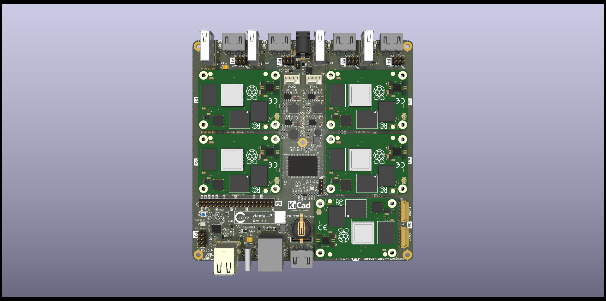
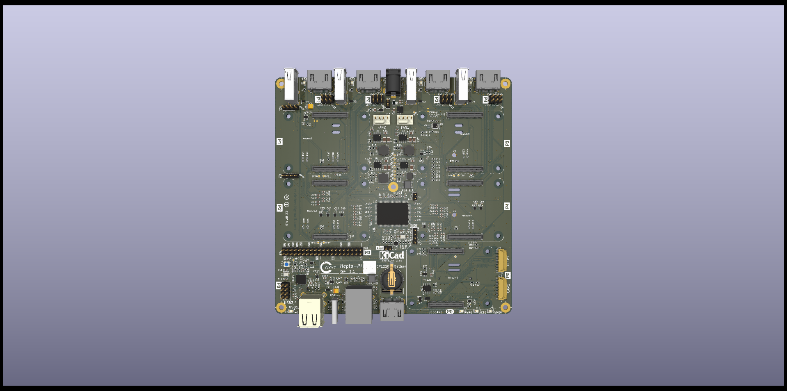
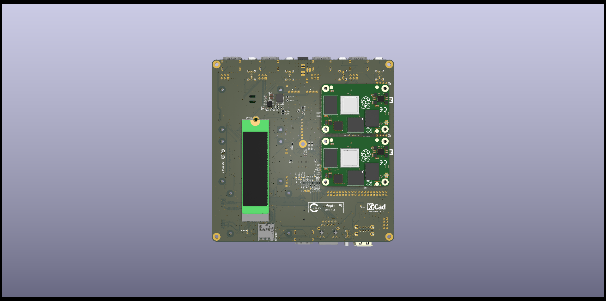
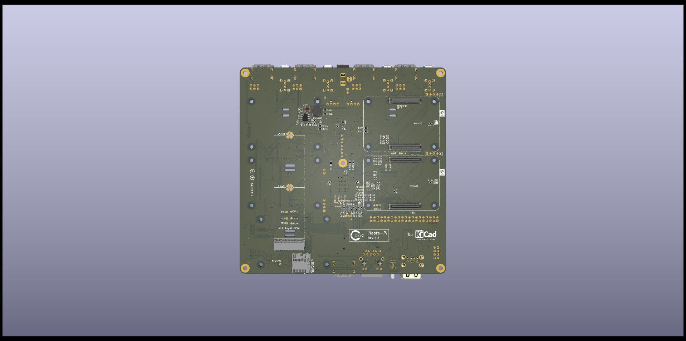

# Hepta-Pi
This is a PCB supporting a Compute Cluser of 7 Raspberrry Pi CM4 sized boards. 

- One of the boards (Board 0) has a
fairly full compliment of I/O. - Boards 1-4, also mounted on the top, have an HDMI and a single USB
port, so can be debugged with a keyboard and monitor.
- Boards 5-6 are mounted on the bottom,
and have a bare minimum of I/O.

All 7 boards are connected to an on-board 1G ethernet switch,
which has 1 external connector.  The overall board size is 150X150mm.   The entire board is powered from a single 12V barrel jack.

I had initially conceived this as a CPU based crypto currency miner, but I later discovered that the ARM 
based CM4 boards and their competitors are not very effective crypto miners. 
So this is left as a generic compute cluster, with workload controlled by something like Kubernetes, Ansible, or Univa Grid Engine.

Here is the top view with and without CM's:

Note that CM0 is on the top, lower right, and has the following peripherals:

- 4 USB connectors, 2 on a connector, and 2 on headers
- 1 USB-C port for EMMC burning
- 1 HDMI port
- 1 Micro SD Card
- 1 CAM and 1 DISP port for flat cables
- A PCI Port is run to a M.2 2280 or 2242 card on the bottom
- A PCF85063AT based realtime clock with CR1220 battery backup
- 2 12V PWM fan connectors that can use an EMC2301 or EMC2302 controller
- A full 40 pin Pi compatible header
- A dedicated header for an individual reset
 
CM1, 2, 3, and 4 are also on the top with the following peripherals:

- 1 USB port
- 1 HDMI port
- A dedicated header for the serial debug port and an individual reset.
  
And here is a bottom view:

CM5 and 6 have only the dedicated header for the serial debug port and an indivdual reset.

Common to everything is an RTL8370 based 1G ethernet switch, and a single ethernet port for all CM's.
There is a single 12V Barrel Connector for the board, and of course power supplies for all.

The following CM4 compatible boards have been tested:

- Raspberry Pi CM4
- Radxa ROCK3-CM
(no support for third connector)
- Pine64 Soquartz
- Banana Pi BPI-CM4

This work is licensed under a
[Creative Commons Attribution 4.0 International License][cc-by].

[![CC BY 4.0][cc-by-image]][cc-by]

[cc-by]: http://creativecommons.org/licenses/by/4.0/
[cc-by-image]: https://i.creativecommons.org/l/by/4.0/88x31.png
[cc-by-shield]: https://img.shields.io/badge/License-CC%20BY%204.0-lightgrey.svg
